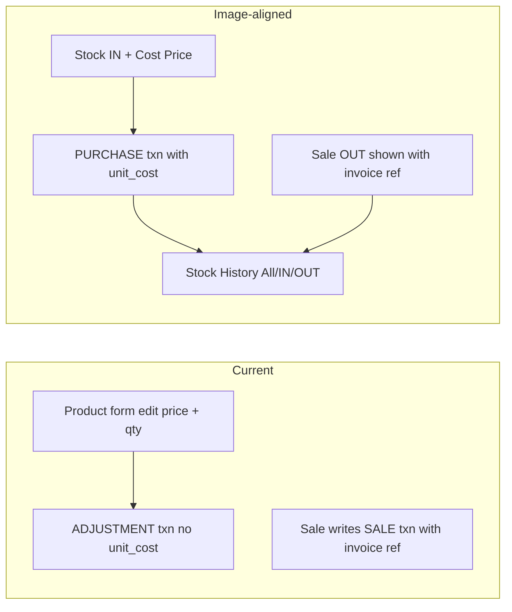

# Stock movements, export, and Get Started

## How your app works today vs the images

| Topic | Your app now | Reference images |
|--------|----------------|------------------|
| Restock at new cost (13 → 17) | Edit product **purchase/selling** + set absolute stock | **Stock IN** with qty + **Cost Price** as its own movement |
| Ledger UI | `stock_transactions` + `StockRepository.history()` exist but **unused** | Full **Stock History** list + filters |
| Add movement | Absolute **Adjust stock** sheet only; `addStock()` unused by UI | Dedicated **Add Stock Movement** (IN/OUT, notes, cost on IN) |
| Sale OUT | Already writes `SALE` + `invoice` ref | Shown on history cards |

**Answer to “stock was 13, later 17 — how to adjust?”** (default for this plan: **purchase/cost**, matching the Cost Price field in the image)

- **Do not** only overwrite product price when new stock arrives at a different cost.
- **Stock IN** `N` units at ₹17 → `PURCHASE` row with `unit_cost=1700` paise, increase `current_stock` by N, set `products.purchase_price` to **latest** cost (17).
- **Selling price** stays independent: change on product form; old invoices keep line snapshots.
- **Qty-only correction** (damage/count) → Stock OUT / adjustment **without** changing cost.
- Past purchases keep their own `unit_cost` on the ledger (history/export). No FIFO/weighted-average P&amp;L in this pass—just correct restocking + latest cost on the product.

---

## 1. Stock History + Add Stock Movement

**Backend (small):**
- Extend [`StockMovement`](lib/shared/models/models.dart) to expose `unitCostPaise`, `referenceType`, `referenceId`, `transactionType`.
- Extend [`StockRepository.history`](lib/core/database/repositories/stock_repository.dart): filter `all` / `in` (qty&gt;0) / `out` (qty&lt;0), search by product name/SKU, join invoice number when `reference_type='invoice'`.
- On `addStock`: after delta, `UPDATE products SET purchase_price = unitCost` when cost provided.
- Wire `stockHistoryProvider` in [`providers.dart`](lib/app/providers.dart).

**UI (match screenshots, use your theme accents):**
- Replace/expand Stock tab: [`inventory_screen.dart`](lib/features/inventory/inventory_screen.dart) becomes overview + entry to history, **or** primary Stock tab = history (All / Stock IN / Stock OUT + search + FAB).
- New [`stock_history_screen.dart`](lib/features/inventory/stock_history_screen.dart): cards with product, SKU, IN/OUT badge, qty, cost/sell meta, sale ref, relative + absolute time.
- New [`add_stock_movement_screen.dart`](lib/features/inventory/add_stock_movement_screen.dart): product search + scan, IN (green) / OUT (grey), Quantity, **Cost Price** (required on IN), Notes (required), Save.
  - IN → `addStock`
  - OUT → `adjustStock` with negative delta (type `ADJUSTMENT`)
- Keep product-form stock edit as absolute adjust for quick fixes; prefer FAB movement for restocks with new cost.
- Routes in [`app_router.dart`](lib/app/router/app_router.dart): `/stock/history`, `/stock/movement`.

No schema migration required (`unit_cost` already on `stock_transactions`).

---

## 2. Export data menu

**Placement:** Settings main card after Backup → **Export data** → `/settings/export`.

**Service:** new [`data_export_service.dart`](lib/core/services/data_export_service.dart) building CSV strings and sharing via `share_plus` (same pattern as reports PDF):

| Export | Rows |
|--------|------|
| Products | name, sku, category, purchase, selling, stock, min, unit, barcodes |
| Orders | invoices + payments summary (and line items file or columns) |
| Customers | name, phone, email, address, credit, outstanding |
| Stocks | stock_transactions ledger (type, qty, unit_cost, refs, note, time) |
| **Export all** | ZIP of the four CSVs (use existing `archive` package) |

UI: [`export_data_screen.dart`](lib/features/settings/export_data_screen.dart) with **Export all** + four separate tiles. Link from [`settings_screen.dart`](lib/features/settings/settings_screen.dart).

---

## 3. Home “Get Started” card

In [`dashboard_screen.dart`](lib/features/dashboard/dashboard_screen.dart), below store-setup reminder:

- Watch `categoriesProvider` + `productsProvider`.
- **Show** when `categories.isEmpty || products.isEmpty`.
- **Hide** when both have ≥1 item; **show again** if user deletes all of either (same condition).
- Card UI like the screenshot: rocket + “Get Started”, subtitle, outlined pills:
  - Add Category → `/categories/edit`
  - Add Product → `/products/edit`
  - Bulk Upload → snack **Coming soon** (CSV import out of scope this pass; avoids half-baked import)

---

## Out of scope (this pass)

- FIFO / weighted average COGS reporting
- Full bulk CSV **import**
- Changing sale pricing via stock movements (selling price stays on product form)
